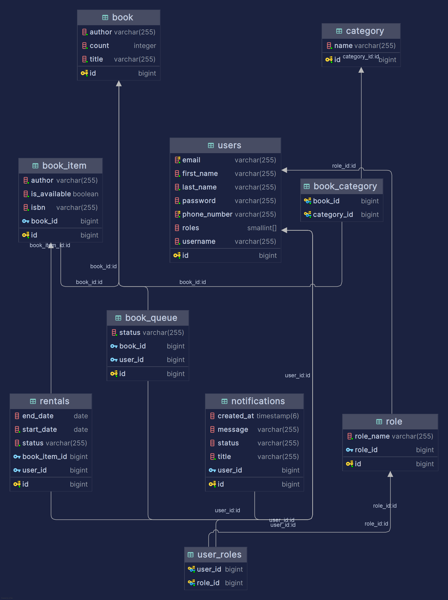
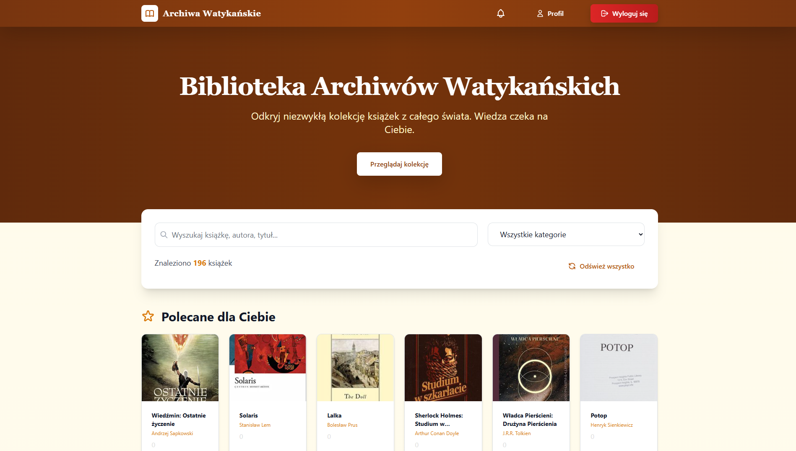
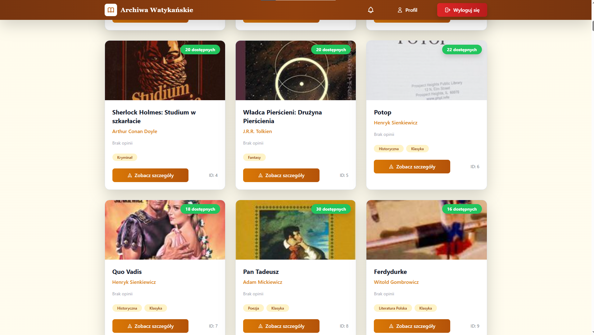
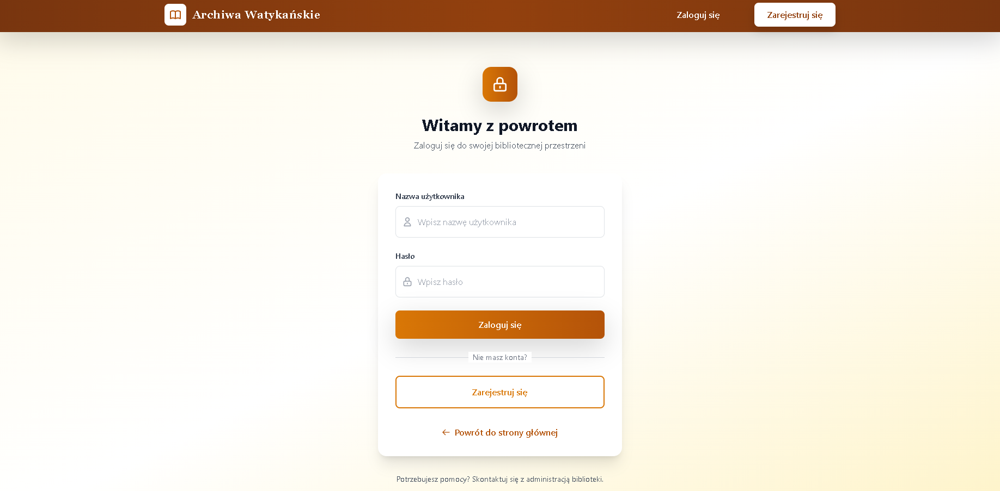
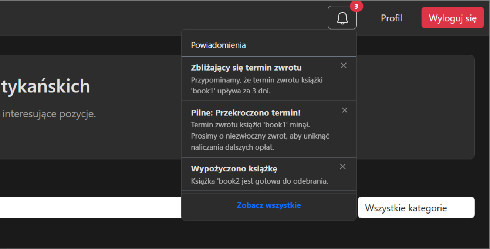
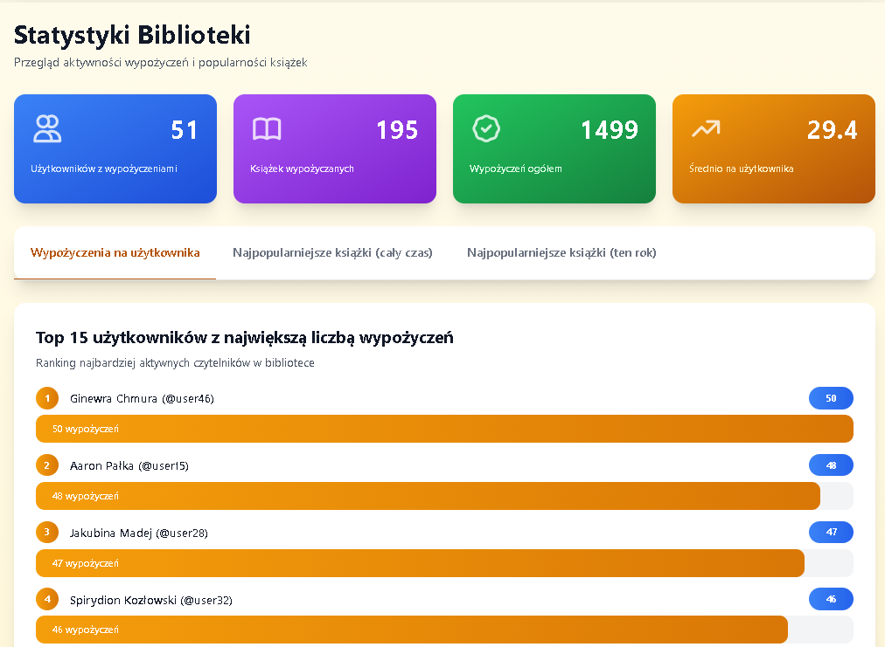

# Library management system

## Description
A full-stack web application designed to streamline library operations, from inventory tracking to automated rental management. Built using Spring Boot and React with Bootstrap.

## Features
- Users can create accounts, browse, and rent books.
- Users can post reviews and read opinions from others regarding books they have read.
- Automated email notifications remind users of upcoming return deadlines and overdue books.
- Integrated in-app notification system for real-time updates.
- Personalized recommendation engine that suggests books based on previously read authors and categories.
- Analytics dashboard generating statistics such as most-read books or trending authors.

## Database schema

## Screenshots

