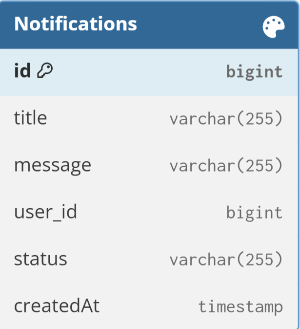
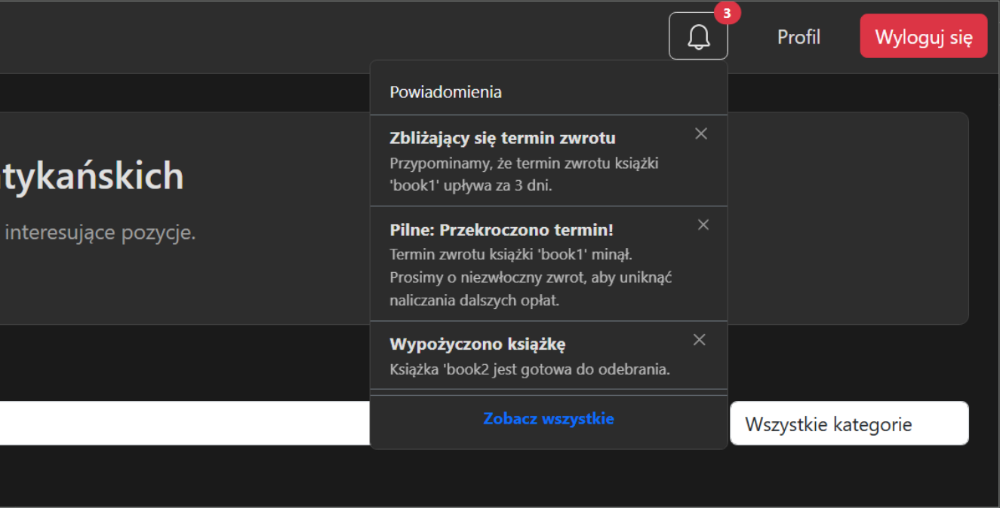
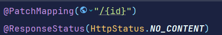
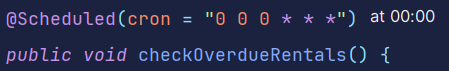
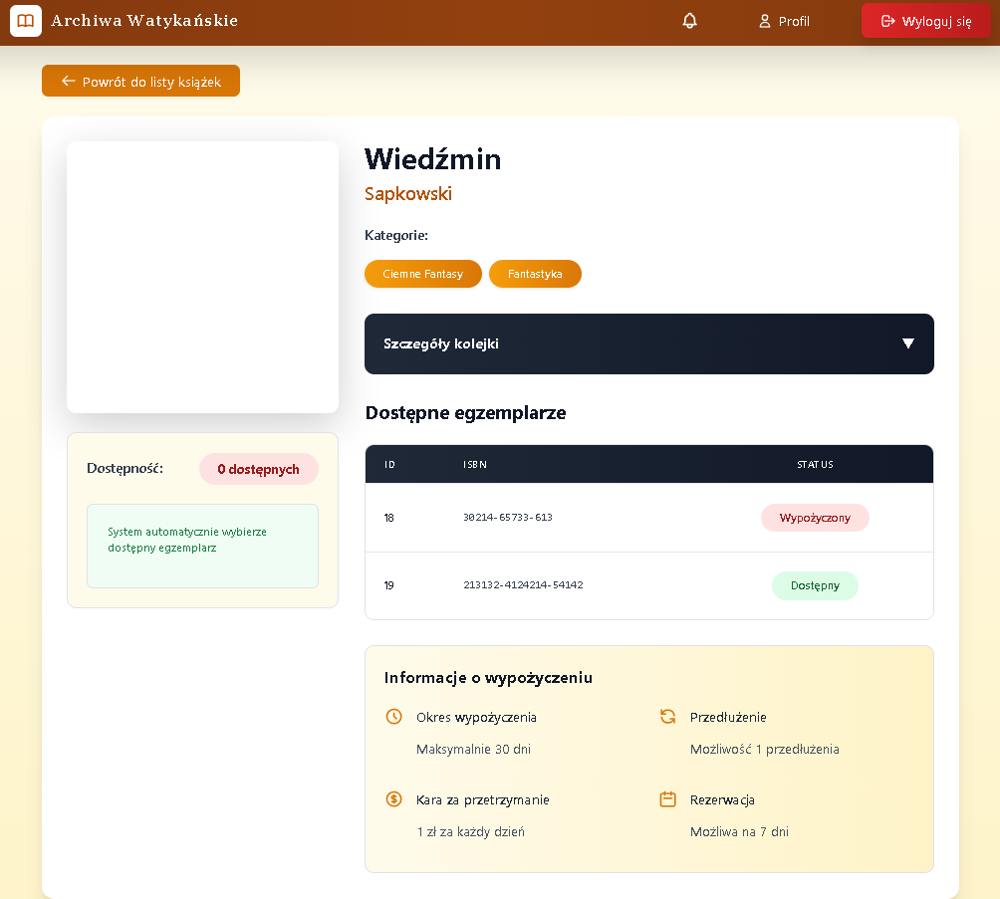

# Archiwa Watykańskie – Opis Aplikacji

**Archiwa Watykańskie** to nowoczesna aplikacja biblioteczna, która umożliwia kompleksowe zarządzanie zbiorami książek oraz kontami użytkowników. Aplikacja została zaprojektowana z myślą o wygodzie użytkowników oraz efektywności obsługi biblioteki.

## Funkcjonalności

### 1. Zarządzanie użytkownikami
- **Rejestracja użytkownika** – możliwość tworzenia nowych kont w systemie.
- **Odczyt użytkownika** – przeglądanie danych użytkowników.
- **Modyfikacja użytkownika** – edycja informacji o użytkownikach.
- **Usuwanie użytkownika** – możliwość usunięcia konta użytkownika.
- **Autentykacja i autoryzacja** – bezpieczne logowanie oraz kontrola dostępu do funkcji aplikacji w zależności od roli użytkownika.

### 2. Zarządzanie książkami
- **CRUD do książek** – tworzenie, odczyt, aktualizacja oraz usuwanie rekordów książek w bibliotece.

### 3. Obsługa wypożyczeń i rezerwacji
- **Wypożyczenia książek** – rejestracja i kontrola bieżących wypożyczeń.
- **Rezerwacje książek** – możliwość rezerwowania dostępnych pozycji przez użytkowników.
- **Powiadomienia o rezerwacjach** – informowanie użytkowników o statusie ich rezerwacji, w tym dostępności książek do odbioru.

## Cel aplikacji
Celem aplikacji **Archiwa Watykańskie** jest usprawnienie procesów bibliotecznych, zapewnienie bezpiecznego zarządzania użytkownikami oraz zwiększenie dostępności informacji o zbiorach, przy jednoczesnym zapewnieniu wygodnego systemu powiadomień i rezerwacji.

## Technologie

- **Backend:** Spring Boot
    - Spring Data JPA (Hibernate) do obsługi bazy danych
    - Spring Security z JWT do autentykacji i autoryzacji
- **Frontend:** React
- **Baza danych:** PostgreSQL (lokalnie)
    - Konfiguracja Spring Boot wskazuje na bazę `jdbc:postgresql://localhost:5432/library`
- **Inne technologie:**
    - JWT do zabezpieczenia API
    - Hibernate Dialect dla PostgreSQL

# Model Bazy Danych – Archiwa Watykańskie

Poniżej przedstawiono opis głównych tabel i pól w aplikacji **Archiwa Watykańskie**.

## Tabela `book`
- **id** (`Long`) – unikalny identyfikator książki.
- **title** (`String`) – tytuł książki, wymagany.
- **author** (`String`) – autor książki, wymagany.
- **count** (`Integer`) – liczba egzemplarzy książki dostępnych w bibliotece.
- **categories** (`Set<Category>`) – kategorie przypisane do książki (relacja wiele-do-wielu).
- **bookItems** (`Set<BookItem>`) – lista konkretnych egzemplarzy książki (relacja jeden-do-wielu).
- **bookQueues** (`Set<BookQueue>`) – kolejka rezerwacji książki (relacja jeden-do-wielu).

## Tabela `category`
- **id** (`Long`) – unikalny identyfikator kategorii.
- **name** (`String`) – nazwa kategorii, wymagana.
- **books** (`Set<Book>`) – książki przypisane do kategorii (relacja wiele-do-wielu).

## Tabela `book_item`
- **id** (`Long`) – unikalny identyfikator egzemplarza książki.
- **isbn** (`String`) – numer ISBN egzemplarza, wymagany.
- **book** (`Book`) – książka, do której należy egzemplarz (relacja wiele-do-jednego).
- **isAvailable** (`Boolean`) – status dostępności egzemplarza.
- **rentals** (`Set<Rentals>`) – wypożyczenia tego egzemplarza (relacja jeden-do-wielu).

## Tabela `book_queue`
- **id** (`Long`) – unikalny identyfikator wpisu w kolejce rezerwacji.
- **user** (`User`) – użytkownik, który dokonał rezerwacji (relacja wiele-do-jednego).
- **book** (`Book`) – książka, którą zarezerwowano (relacja wiele-do-jednego).
- **status** (`String`) – status rezerwacji (np. oczekująca, gotowa do odbioru).

## Tabela `rentals`
- **id** (`Long`) – unikalny identyfikator wypożyczenia.
- **user** (`User`) – użytkownik, który wypożyczył książkę (relacja wiele-do-jednego).
- **bookItem** (`BookItem`) – konkretny egzemplarz wypożyczonej książki (relacja wiele-do-jednego).
- **status** (`String`) – status wypożyczenia (np. aktywne, zakończone).
- **startDate** (`LocalDate`) – data rozpoczęcia wypożyczenia, wymagana.
- **endDate** (`LocalDate`) – data zakończenia wypożyczenia.

## Tabela `users`
- **id** (`Long`) – unikalny identyfikator użytkownika.
- **username** (`String`) – nazwa użytkownika, wymagana.
- **password** (`String`) – hasło użytkownika, wymagane.
- **firstName** (`String`) – imię użytkownika, wymagane.
- **lastName** (`String`) – nazwisko użytkownika, wymagane.
- **email** (`String`) – adres e-mail użytkownika, wymagany i unikalny.
- **phoneNumber** (`String`) – numer telefonu użytkownika, wymagany i unikalny.
- **roles** (`Set<Role>`) – role przypisane użytkownikowi (relacja wiele-do-wielu).
- **rentals** (`Set<Rentals>`) – wypożyczenia dokonane przez użytkownika (relacja jeden-do-wielu).
- **bookQueues** (`Set<BookQueue>`) – rezerwacje użytkownika (relacja jeden-do-wielu).

## Tabela `role`
- **id** (`Long`) – unikalny identyfikator roli.
- **roleName** (`String`) – nazwa roli użytkownika, wymagana (np. ADMIN, USER).

## Tabele pośrednie
- **book_category** – relacja wiele-do-wielu między książkami a kategoriami.
- **user_roles** – relacja wiele-do-wielu między użytkownikami a rolami.

## DO UZUPEŁNIENIA TABELA RECENZJE

# Endpointy REST – Archiwa Watykańskie

## 1. Endpointy książek (`/book`)

| Metoda | Ścieżka | Uprawnienia | Opis |
|--------|---------|------------|------|
| GET | `/book` | Public | Pobiera listę wszystkich książek. |
| GET | `/book/{bookId}` | Public | Pobiera szczegóły jednej książki wraz z kategoriami i liczbą egzemplarzy. |
| POST | `/book` | ADMIN | Tworzy nową książkę w bibliotece. |
| PUT | `/book/{id}` | ADMIN | Aktualizuje dane istniejącej książki. |
| DELETE | `/book/{id}` | ADMIN | Usuwa książkę z biblioteki. |
| GET | `/book/{bookId}/items` | Public | Pobiera listę wszystkich egzemplarzy danej książki. |
| POST | `/book/{bookId}/items` | ADMIN | Dodaje nowy egzemplarz książki i zwiększa licznik dostępnych egzemplarzy. |
| PUT | `/book/items/{itemId}` | ADMIN | Aktualizuje dane konkretnego egzemplarza książki. |
| DELETE | `/book/items/{itemId}` | ADMIN | Usuwa egzemplarz książki i zmniejsza licznik dostępnych egzemplarzy. |

---

## 2. Endpointy kolejek rezerwacji (`/queue`)

| Metoda | Ścieżka | Uprawnienia | Opis |
|--------|---------|------------|------|
| POST | `/queue/reserve` | USER, ADMIN | Rezerwuje książkę dla użytkownika i dodaje go do kolejki. |
| GET | `/queue/book/{bookId}/position` | USER, ADMIN | Pobiera pozycję użytkownika w kolejce do danej książki. |
| GET | `/queue/book/{bookId}/has-queue` | Public | Sprawdza, czy książka ma jakąkolwiek kolejkę rezerwacyjną. |
| GET | `/queue/book/{bookId}/is-reserved` | Public | Sprawdza, czy książka jest zarezerwowana dla użytkownika. |
| DELETE | `/queue/leave` | USER, ADMIN | Umożliwia użytkownikowi opuszczenie kolejki do książki. |
| GET | `/queue/user/{userId}` | USER, ADMIN | Pobiera wszystkie kolejki rezerwacyjne użytkownika. |
| GET | `/queue/book/{bookId}/details` | ADMIN | Pobiera szczegóły kolejki dla konkretnej książki. |

---

## 3. Endpointy kategorii (`/category`)

| Metoda | Ścieżka | Uprawnienia | Opis |
|--------|---------|------------|------|
| GET | `/category` | Public | Pobiera listę wszystkich kategorii. |
| GET | `/category/{id}` | Public | Pobiera szczegóły jednej kategorii. |
| POST | `/category` | ADMIN | Tworzy nową kategorię. |
| PUT | `/category/{id}` | ADMIN | Aktualizuje nazwę istniejącej kategorii. |
| DELETE | `/category/{id}` | ADMIN | Usuwa kategorię, jeśli nie jest powiązana z książkami. |

---

## 4. Endpointy wypożyczeń (`/rentals`)

| Metoda | Ścieżka | Uprawnienia | Opis |
|--------|---------|------------|------|
| POST | `/rentals/rent` | USER, ADMIN | Wypożycza konkretny egzemplarz książki dla użytkownika. |
| POST | `/rentals/rent-by-book` | USER, ADMIN | Automatycznie wypożycza dostępny egzemplarz danej książki. |
| POST | `/rentals/return/{rentalId}` | USER, ADMIN | Zwraca wypożyczoną książkę i aktualizuje status wypożyczenia. |
| GET | `/rentals/user/{userId}` | USER, ADMIN | Pobiera listę wszystkich wypożyczeń użytkownika. |

---

## 5. Endpointy użytkowników (`/user`)

| Metoda | Ścieżka | Uprawnienia | Opis |
|--------|---------|------------|------|
| POST | `/user/register` | Public | Rejestruje nowego użytkownika w systemie. |
| POST | `/user/login` | Public | Loguje użytkownika i zwraca token JWT. |
| GET | `/user/{id}` | ADMIN lub właściciel konta | Pobiera dane użytkownika po ID. |
| GET | `/user` | ADMIN | Pobiera listę wszystkich użytkowników. |
| PUT | `/user/{id}` | ADMIN lub właściciel konta | Aktualizuje dane użytkownika. |
| DELETE | `/user/{id}` | ADMIN lub właściciel konta | Usuwa konto użytkownika. |

## 6. Endpointy powiadomień (`/notifications`)

| Metoda | Ścieżka | Uprawnienia | Opis |
|--------|---------|------------|------|
| GET | `/notifications/new` | Zalogowany użytkownik | Pobiera wszystkie **nowe** powiadomienia użytkownika. |
| GET | `/notifications` | Zalogowany użytkownik | Pobiera wszystkie powiadomienia użytkownika (zarówno przeczytane, jak i nowe). |
| PATCH | `/notifications/{id}` | Zalogowany użytkownik | Oznacza konkretne powiadomienie jako przeczytane. |

# UZUPEŁNIENIE ENDPOINTY DO REVIEWS

# Dokumentacja Backendu

## Serwisy

### `BookService`
Serwis zarządzający książkami, w tym tworzenie, aktualizacja, usuwanie i wyszukiwanie.

- `createBook(Book book)` – Tworzy nową książkę i mapuje jej kategorie.
- `updateBook(Long id, Book bookDetails)` – Aktualizuje istniejącą książkę wraz z kategoriami.
- `getBookById(Long id)` – Zwraca książkę o podanym ID lub rzuca wyjątek, jeśli nie istnieje.
- `getAllBooks()` – Zwraca listę wszystkich książek.
- `deleteBook(Long id)` – Usuwa książkę o podanym ID.
- `incrementBookCount(Long bookId)` – Zwiększa liczbę dostępnych egzemplarzy książki.
- `decrementBookCount(Long bookId)` – Zmniejsza liczbę dostępnych egzemplarzy książki, jeśli większa od zera.
- `searchBooks(String title, String author, String categoryName)` – Wyszukuje książki według tytułu, autora lub kategorii.

### `BookItemService`
Serwis zarządzający egzemplarzami książek i ich dostępnością.

- `createBookItem(Long bookId, BookItem bookItem)` – Tworzy nowy egzemplarz książki i przypisuje go do książki.
- `updateBookItem(Long itemId, BookItem details)` – Aktualizuje dane egzemplarza książki.
- `getBookItemById(Long id)` – Zwraca egzemplarz książki po ID lub rzuca wyjątek.
- `getBookItemsByBook(Long bookId)` – Zwraca wszystkie egzemplarze danej książki.
- `deleteBookItem(Long id)` – Usuwa egzemplarz książki o podanym ID.
- `updateBookItemStatus(Long id, Boolean isAvailable)` – Aktualizuje status dostępności egzemplarza.
- `getAllBookItems()` – Zwraca listę wszystkich egzemplarzy książek.
- `getAvailableBookItemsByBook(Long bookId)` – Zwraca dostępne egzemplarze danej książki.
- `markAsRented(Long bookItemId)` – Oznacza egzemplarz jako wypożyczony i zmniejsza licznik książki.
- `markAsAvailable(Long bookItemId)` – Oznacza egzemplarz jako dostępny i zwiększa licznik książki.
- `isBookItemAvailable(Long bookItemId)` – Sprawdza, czy egzemplarz jest dostępny.

### `BookQueueService`
Serwis zarządzający kolejką rezerwacyjną książek i powiadomieniami.

- `addToQueue(Long userId, Long bookId)` – Dodaje użytkownika do kolejki dla danej książki.
- `removeFromQueue(Long queueId)` – Usuwa wpis z kolejki po ID.
- `getQueueById(Long id)` – Zwraca wpis w kolejce po ID lub rzuca wyjątek.
- `getQueueByBook(Long bookId)` – Zwraca listę wszystkich wpisów kolejki dla książki w statusie WAITING lub NOTIFIED.
- `getUserQueues(Long userId)` – Zwraca wszystkie wpisy w kolejce danego użytkownika.
- `processNextInQueue(Long bookId)` – Zwraca kolejny wpis w kolejce do przetworzenia.
- `getPositionInQueue(Long userId, Long bookId)` – Zwraca pozycję użytkownika w kolejce (1-based) lub -1 jeśli nie ma go w kolejce.
- `notifyAvailableBook(Long bookId)` – Powiadamia pierwszego użytkownika w kolejce o dostępnej książce.
- `removeUserFromNotifiedQueue(Long userId, Long bookId)` – Usuwa użytkownika z kolejki z powiadomionymi książkami.
- `canUserBorrowBook(Long userId, Long bookId)` – Sprawdza, czy użytkownik może wypożyczyć książkę.
- `leaveQueue(Long userId, Long bookId)` – Pozwala użytkownikowi opuścić kolejkę.
- `isBookReservedForUser(Long bookId)` – Sprawdza, czy książka jest zarezerwowana dla pierwszego użytkownika w kolejce.

### `CategoryService`
Serwis zarządzający kategoriami książek.

- `createCategory(Category category)` – Tworzy nową kategorię.
- `getCategoryById(Long id)` – Zwraca kategorię po ID lub rzuca wyjątek.
- `getCategoryByName(String name)` – Zwraca kategorię po nazwie lub rzuca wyjątek.
- `getAllCategories()` – Zwraca listę wszystkich kategorii.
- `updateCategory(Long id, Category categoryDetails)` – Aktualizuje nazwę kategorii.
- `deleteCategory(Long id)` – Usuwa kategorię po ID.
- `searchCategories(String name)` – Wyszukuje kategorie po nazwie lub częściowej nazwie.

### `RentalsService`
Serwis zarządzający wypożyczeniami książek.

- `rentBook(Long userId, Long bookItemId)` – Wypożycza egzemplarz książki dla użytkownika.
- `rentBookAuto(Long userId, Long bookId)` – Automatycznie wypożycza pierwszy dostępny egzemplarz książki.
- `returnBook(Long rentalId)` – Zwraca wypożyczoną książkę i powiadamia kolejkę.
- `extendRental(Long rentalId, int additionalDays)` – Przedłuża wypożyczenie o podaną liczbę dni.
- `getRentalById(Long id)` – Zwraca wypożyczenie po ID lub rzuca wyjątek.
- `getAllRentals()` – Zwraca listę wszystkich wypożyczeń.
- `getRentalsByUser(Long userId)` – Zwraca wszystkie wypożyczenia danego użytkownika.
- `getActiveRentalsByUser(Long userId)` – Zwraca aktywne wypożyczenia danego użytkownika.
- `getOverdueRentals()` – Zwraca listę wypożyczeń zaległych.

### `UserService`
Serwis zarządzający użytkownikami, w tym tworzenie, aktualizacja, usuwanie i zarządzanie rolami.

- `loadUserByUsername(String username)` – Zwraca szczegóły użytkownika po nazwie użytkownika dla Spring Security.
- `addUser(User user)` – Dodaje nowego użytkownika, weryfikuje unikalność danych i przypisuje rolę USER.
- `getUserById(Long id)` – Zwraca użytkownika po ID lub rzuca wyjątek jeśli nie istnieje.
- `getAllUsers()` – Zwraca listę wszystkich użytkowników.
- `updateUser(Long id, User userDetails)` – Aktualizuje dane użytkownika po ID z weryfikacją unikalności.
- `deleteUser(Long id)` – Usuwa użytkownika po ID.
- `addRole(User user, Role role)` – Dodaje rolę do użytkownika w bazie danych.

## Repozytoria

### `BookRepository`
Repozytorium książek z możliwością wyszukiwania i filtrowania.

- `findByTitleContainingIgnoreCase(String title)` – Wyszukuje książki po częściowym tytule.
- `findByAuthorContainingIgnoreCase(String author)` – Wyszukuje książki po częściowym autorze.
- `findByCategoriesContaining(Category category)` – Wyszukuje książki w danej kategorii.
- `findAvailableBooks()` – Zwraca książki, które mają co najmniej jeden egzemplarz dostępny.

### `BookItemRepository`
Repozytorium egzemplarzy książek.

- `findByBook(Book book)` – Zwraca wszystkie egzemplarze książki.
- `findByBookAndIsAvailableTrue(Book book)` – Zwraca dostępne egzemplarze książki.
- `findByIsAvailableTrue()` – Zwraca wszystkie dostępne egzemplarze.
- `findByIdWithBook(Long id)` – Zwraca egzemplarz z powiązaną książką po ID.

### `BookQueueRepository`
Repozytorium kolejki rezerwacyjnej.

- `findByBook(Book book)` – Zwraca wpisy kolejki dla książki.
- `findByBookOrderByIdAsc(Book book)` – Zwraca wpisy kolejki dla książki posortowane po ID.
- `findByUser(User user)` – Zwraca wpisy kolejki użytkownika.
- `findByUserAndBook(User user, Book book)` – Zwraca wpisy kolejki dla użytkownika i książki.
- `findByBookAndStatusOrderByIdAsc(Book book, String status)` – Zwraca wpisy kolejki według statusu.
- `existsByUserAndBookAndStatus(User user, Book book, String status)` – Sprawdza istnienie wpisu w kolejce.

### `CategoryRepository`
Repozytorium kategorii książek.

- `findByName(String name)` – Zwraca kategorię po nazwie.
- `findByNameContainingIgnoreCase(String name)` – Wyszukuje kategorie po częściowej nazwie.

### `RentalsRepository`
Repozytorium wypożyczeń książek.

- `findByUser(User user)` – Zwraca wypożyczenia użytkownika z pełnymi danymi książki.
- `findByUserAndStatus(User user, String status)` – Zwraca wypożyczenia użytkownika według statusu.
- `findOverdueRentals(LocalDate currentDate)` – Zwraca zaległe wypożyczenia.
- `findByStatusAndEndDate(String status, LocalDate soon)` – Zwraca wypożyczenia według statusu i daty zakończenia.

### `RoleRepository`
Repozytorium ról użytkowników.

- `findByRoleName(String roleName)` – Zwraca rolę po nazwie roli.

### `UserRepository`
Repozytorium użytkowników.

- `findByUsername(String username)` – Zwraca użytkownika po nazwie użytkownika.
- `findByEmail(String email)` – Zwraca użytkownika po adresie e-mail.
- `findByPhoneNumber(String phoneNumber)` – Zwraca użytkownika po numerze telefonu.

## Kontrolery

### `BookController`
Kontroler obsługujący książki i egzemplarze.

- `getAllBooks()` – Zwraca listę wszystkich książek.
- `createBook(Book book)` – Tworzy nową książkę (rola ADMIN).
- `updateBook(Long id, Book bookDetails)` – Aktualizuje książkę (rola ADMIN).
- `deleteBook(Long id)` – Usuwa książkę (rola ADMIN).
- `getBookItems(Long bookId)` – Zwraca egzemplarze książki.
- `createBookItem(Long bookId, BookItem bookItem)` – Tworzy egzemplarz książki (rola ADMIN).
- `deleteBookItem(Long itemId)` – Usuwa egzemplarz książki (rola ADMIN).
- `updateBookItem(Long itemId, BookItem bookItemDetails)` – Aktualizuje egzemplarz (rola ADMIN).
- `getBook(Long bookId)` – Zwraca szczegóły książki.

### `BookQueueController`
Kontroler obsługujący kolejkę rezerwacyjną.

- `reserveBook(Long userId, Long bookId)` – Rezerwuje książkę dla użytkownika.
- `getPosition(Long userId, Long bookId)` – Zwraca pozycję użytkownika w kolejce.
- `hasQueue(Long bookId)` – Sprawdza, czy dla książki istnieje kolejka.
- `isReserved(Long bookId)` – Sprawdza, czy książka jest zarezerwowana dla użytkownika.
- `leaveQueue(Long userId, Long bookId)` – Umożliwia opuszczenie kolejki.
- `getUserQueues(Long userId)` – Zwraca wszystkie kolejki użytkownika.
- `getQueueDetails(Long bookId)` – Zwraca szczegóły kolejki dla książki (rola ADMIN).

### `CategoryController`
Kontroler obsługujący kategorie książek.

- `getAllCategories()` – Zwraca listę wszystkich kategorii.
- `getCategory(Long id)` – Zwraca kategorię po ID.
- `createCategory(Category category)` – Tworzy nową kategorię (rola ADMIN).
- `updateCategory(Long id, Category categoryDetails)` – Aktualizuje kategorię (rola ADMIN).
- `deleteCategory(Long id)` – Usuwa kategorię (rola ADMIN).

### `RentalsController`
Kontroler obsługujący wypożyczenia.

- `rentBook(Long bookItemId, Long userId)` – Wypożycza konkretny egzemplarz książki.
- `rentBookAuto(Long bookId, Long userId)` – Automatycznie wypożycza dostępny egzemplarz książki.
- `returnBook(Long rentalId)` – Zwraca wypożyczoną książkę.
- `getUserRentals(Long userId)` – Zwraca wszystkie wypożyczenia użytkownika.

### `UserController`
Kontroler obsługujący użytkowników i logowanie/rejestrację.

- `POST /user/register` – Rejestruje nowego użytkownika i zapisuje go w bazie danych.
- `POST /user/login` – Loguje użytkownika i generuje token JWT z rolami.
- `GET /user/{id}` – Zwraca dane użytkownika po ID (dostęp dla ADMIN lub samego użytkownika).
- `GET /user` – Zwraca listę wszystkich użytkowników (dostęp dla ADMIN).
- `PUT /user/{id}` – Aktualizuje dane użytkownika po ID (dostęp dla ADMIN lub samego użytkownika).
- `DELETE /user/{id}` – Usuwa użytkownika po ID (dostęp dla ADMIN lub samego użytkownika).

---

### Powiadomienia
W bazie danych powiadomienia są obsługiwane przez tabelę o następującej strukturze:

Gdzie:
- title - tytuł powiadomienia
- message - treść powiadomienia
- user_id - id użytkownika którego dotyczy dane powiadomienie
- status - NEW lub READ
- createdAt - data przydatna do wyświetlania w kolejności od najnowszego
#### Wygląd w interfejsie
Powiadomienia są wyświetlane w GUI:

Możliwy jest również podgląd wszystkich powiadomień, razem z tymi które zostały już oznaczone jako przeczytane:

Dodatkowo, oprócz wyświetlania powiadomień w interfejsie użytkownika wysyłane jest również powiadomienie mailowo, poprzez wykorzystanie Spring Mail.

Powiadomienia są wysyłane w następujących wypadkach:
- Kiedy przyjdzie kolej danego użytkownika na wypożyczenie książki,
- Kiedy termin oddania książki mija za trzy dni,
- Kiedy termin oddania książki minął,
- Kiedy wypożyczamy książkę,
- Kiedy oddamy książkę.

#### Api do obsługi powiadomień:

Pozwala pobrać jeszcze nieprzeczytane powiadomienia

Pozwala pobrać wszystkie powiadomienia, w tym te przeczytane.

Pozwala oznaczyć powiadomienie jako przeczytane.

#### Scheduler
Klasa RentalsScheduler zajmuje się sprawdzaniem stanu wypożyczeń. O północy wywoływane są dwie metody:

oraz

Pierwsza metoda sprawdza aktualne wypożyczenia w celu znalezienia tych które są już po terminie oddania - w tym przypadku oznacza te wypożyczenia jako OVERDUE. Druga metoda szuka tych wypożyczeń, których termin upływa za trzy dni w celu powiadomienia o tym użytkownika.

---

# Dokementacja frontendu + Wygląd strony

## `/register` – RegisterPage

Komponent **RegisterPage** umożliwia rejestrację nowego użytkownika:

- Formularz rejestracyjny z walidacją (w tym potwierdzenie hasła).
- Po udanej rejestracji automatyczne logowanie lub przekierowanie do `/login`.
- Obsługa błędów z API.

## `/login` – LoginPage

Komponent **LoginPage** umożliwia użytkownikowi logowanie:

- Formularz logowania z walidacją.
- Obsługa błędów odpowiedzi z API.
- Po zalogowaniu zapisuje token i przekierowuje na stronę główną.

## `/book` – BookDetails

Komponent **BookDetails** pozwala użytkownikowi przeglądać szczegóły pojedynczej książki, w tym jej egzemplarze, status w kolejce oraz opcje wypożyczenia lub rezerwacji.

Funkcjonalności:

- Pobranie szczegółów książki i jej egzemplarzy z API.
- Wyświetlenie okładki książki (Open Library / Google Books API).
- Sprawdzenie statusu wypożyczenia użytkownika.
- Możliwość wypożyczenia książki (jeśli dostępna).
- Rezerwacja książki w kolejce lub opuszczenie kolejki.
- Dla administratora:
    - Podgląd kolejki użytkowników dla książki.
    - Zarządzanie kolejką.

## BookManagement

Komponent **BookManagement** umożliwia administratorowi zarządzanie książkami, kategoriami i egzemplarzami.

Funkcjonalności:

- Pobranie wszystkich książek i kategorii.
- Dodawanie, edytowanie i usuwanie książek.
- Dodawanie, edytowanie i usuwanie kategorii.
- Dodawanie, edytowanie i usuwanie egzemplarzy książek.
- Wybór kategorii dla książki.
- Walidacja formularzy i obsługa błędów.

## `/` – HomePage

Komponent **HomePage** to strona główna dla użytkownika zalogowanego:

- Wyświetla listę książek.
- Wyszukiwanie książek po tytule lub autorze.
- Filtrowanie książek po kategorii.
- Pobiera i wyświetla okładki książek (Open Library API).
- Kliknięcie na książkę przekierowuje do `/book/:id`.

## `/profile` – ProfilePage

Komponent **ProfilePage** pozwala użytkownikowi:

- Przeglądać i edytować swoje dane osobowe.
- Zobaczyć swoje wypożyczenia i rezerwacje książek.
- Zwracać książki.
- Opuszczać kolejki.
- Dla administratora:
    - Zarządzać wszystkimi użytkownikami (edycja, usuwanie).

### Możliwości Administratora

## `/notifications` – NotificationsPage

Komponent **NotificationsPage** wyświetla wszystkie powiadomienia użytkownika:

- Pobiera powiadomienia po załadowaniu strony.
- Obsługuje loading i błędy pobierania.

## NotificationDropdown

Komponent **NotificationDropdown** wyświetla nowe powiadomienia w dropdownie:

- Pobiera powiadomienia z API co 30 sekund.
- Wyświetla listę powiadomień z tytułem i treścią.
- Pozwala oznaczyć powiadomienie jako przeczytane.

